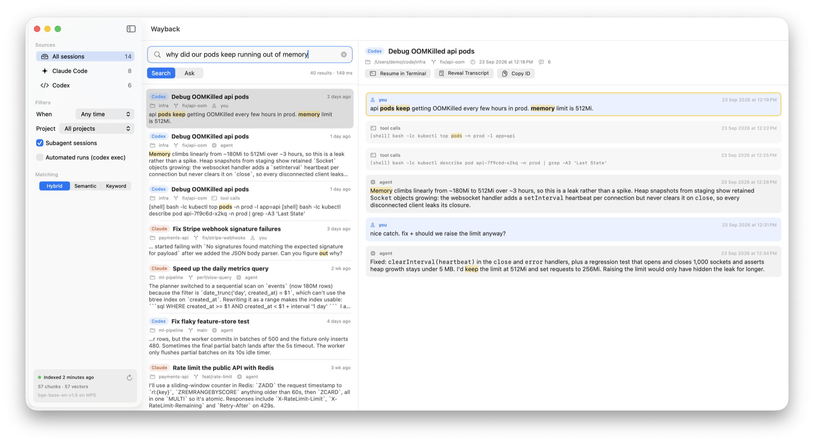
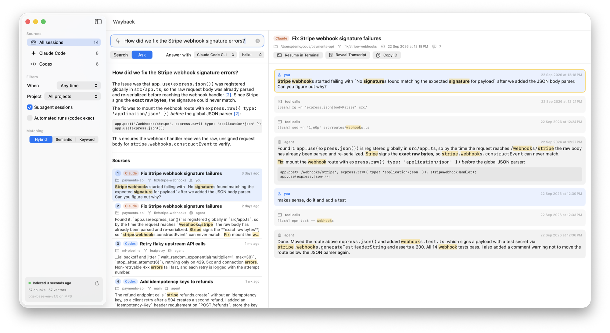
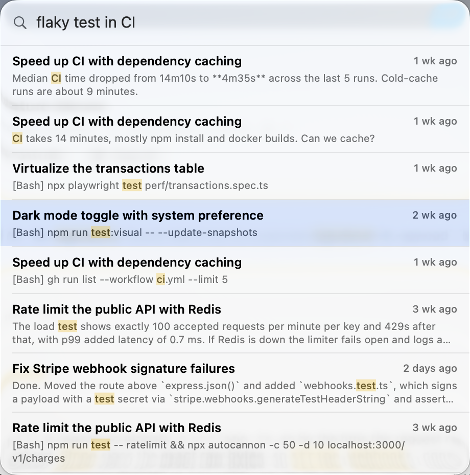

# Wayback

Search every Claude Code and Codex session on your Mac. Wayback indexes your agent transcripts
locally with on-device embeddings, so you can find that command, decision or fix from three weeks ago.
You can also ask questions and get answers with citations back to the exact sessions.



- **Search**: hybrid semantic + keyword search across `~/.claude/projects` and `~/.codex/sessions`.
  Typical latency is about 200 ms.
- **Ask**: RAG over your sessions. Retrieval runs locally; answers come from your own `claude` or
  `codex` CLI, or a local Ollama model.
- **Menu bar**: click the 🔍 icon for a quick Claude Code search. Press **⌥⇧Space** from anywhere
  to open the full app.
- **Transcripts**: open any session at the matching message, or resume it in Terminal.

<table>
  <tr>
    <td width="68%"></td>
    <td width="32%"></td>
  </tr>
  <tr>
    <td align="center"><b>Ask</b>: answers cite the sessions they came from</td>
    <td align="center"><b>Menu bar</b>: quick search across Claude Code sessions</td>
  </tr>
</table>

<sub>Screenshots use a fictional demo dataset (<code>scripts/demo_data.py</code>), not real sessions.</sub>

## Install

Requires an Apple Silicon Mac on macOS 14 or later.

1. Download `Wayback.zip` from the [latest release](../../releases/latest), unzip it and move
   **Wayback.app** to `/Applications`.
2. The app isn't notarized, so macOS blocks it the first time. Open it once, then go to
   **System Settings → Privacy & Security** and click **Open Anyway**. Or run:
   ```sh
   xattr -dr com.apple.quarantine /Applications/Wayback.app
   ```
   Downloading with `gh release download -R parthmahajan008/wayback -p Wayback.zip` skips the warning.
3. On first launch Wayback sets up its Python environment (about 900 MB, mostly PyTorch) and downloads
   the embedding model. It then indexes your history, newest sessions first. Keyword search works
   right away, and semantic search fills in as embedding progresses.

Ask mode uses whichever of these you have: the `claude` CLI (logged in), the `codex` CLI, or
[Ollama](https://ollama.com) with a model pulled. Search needs none of them.

## Privacy

- Your transcripts, index and embeddings never leave your Mac. The index lives in
  `~/Library/Application Support/Wayback/`.
- Search makes no network calls.
- Ask sends the top ~10 retrieved excerpts to the model you pick (Anthropic via `claude`, OpenAI via
  `codex`, or nothing if you use Ollama). The CLIs run in non-persisting mode, so asking doesn't create
  new sessions.

## How it works

- **Parsing**: reads Claude Code and Codex JSONL transcripts. It keeps your prompts, the agents'
  replies and one line per tool call, and strips injected context (AGENTS.md, environment blocks,
  system reminders, compaction prompts).
- **Storage**: about 1200-character chunks in SQLite, with an FTS5 keyword index.
- **Embeddings**: [`BAAI/bge-base-en-v1.5`](https://huggingface.co/BAAI/bge-base-en-v1.5) via
  sentence-transformers on the Apple GPU (MPS). Vectors are keyed by content hash, so forked or
  resumed sessions never re-embed old text.
- **Retrieval**: cosine similarity over a GPU-resident fp16 matrix plus BM25, fused with
  reciprocal-rank fusion and deduplicated.
- **Updates**: the index refreshes incrementally every 2 minutes.
- Automated `codex exec` runs are indexed but hidden by default. Toggle them in the sidebar.
- URL scheme: `wayback://search?q=…` (add `&open=1` to jump to the best match) and `wayback://ask?q=…`,
  handy for Raycast or Alfred.

## Build from source

```sh
brew install uv
./build.sh    # compiles the Swift app, bundles uv + the Python backend, installs to ~/Applications
```

- Environment overrides: `WAYBACK_CLAUDE_DIR` (default `~/.claude`), `WAYBACK_CODEX_DIR` (default `~/.codex`),
  `WAYBACK_MODEL`, `WAYBACK_PORT` (default 8765), `WAYBACK_INTERVAL` (seconds).
- Backend log: `~/Library/Application Support/Wayback/backend.log`.
- Dev server: `cd backend && PYTHONPATH=. uv run python -m wayback.server`. The app reuses a backend
  that's already running.

## License

Wayback is licensed under the [Apache License 2.0](LICENSE). See [NOTICE](NOTICE) and
[THIRD_PARTY_NOTICES.md](THIRD_PARTY_NOTICES.md) for bundled and downloaded components.

Not affiliated with Anthropic or OpenAI.
